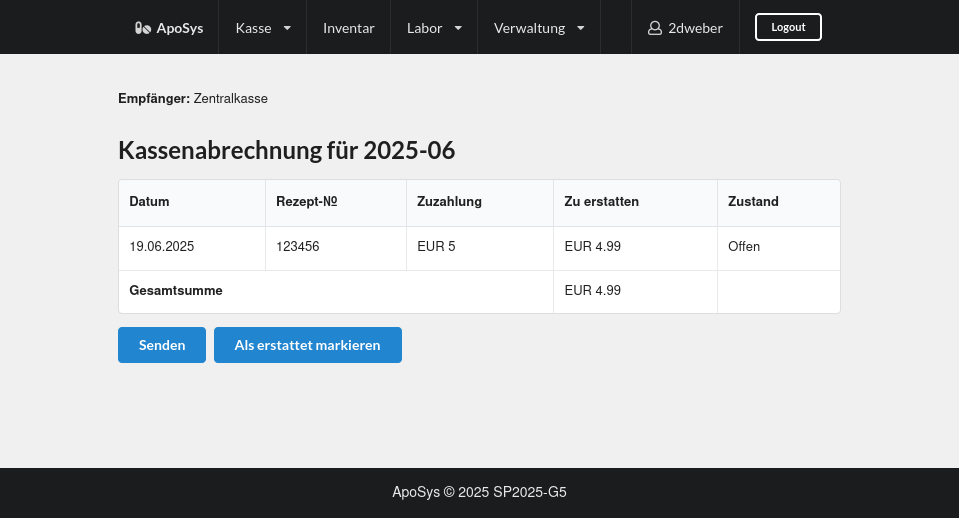
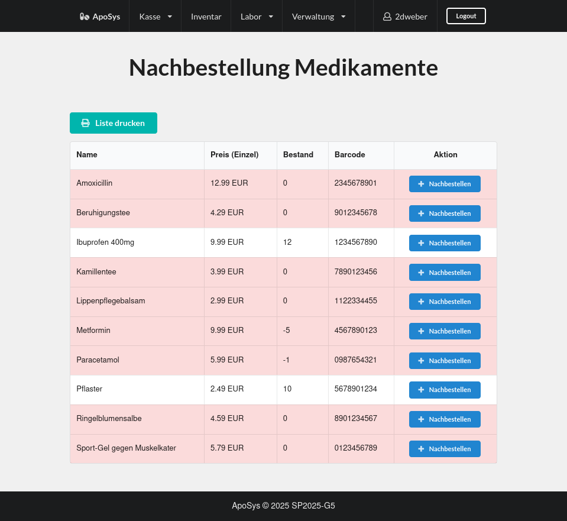

:project_name: Apotheke-Software
:toc: left
:numbered:
:toc-title: Inhaltsverzeichnis
= Pflichtenheft __{project_name}__

[options="header"]
[cols="1, 1, 1, 1, 4"]
|===
|Version | Status      | Bearbeitungsdatum   | Autoren(en) |  Vermerk
|0.1     | In Arbeit   | 03.04.2025          | Hamza Boujeddaine, Anton Liaposhchenko, Anne Panzer, Eqbal Al-Qadami       | Initiale Version
|0.9    | In Arbeit | 14.04.2025 | Hamza Boujeddaine, Anton Liaposhchenko, Anne Panzer, Eqbal Al-Qadami | Nachtrag Versionierung
|1.0    | Meilenstein | 23.04.2025          | Hamza Boujeddaine, Anton Liaposhchenko, Anne Panzer, Eqbal Al-Qadami, Lakhani, Bhargav Ghanshyambhai        | Pflichtenheft
|1.1    | Anpassungen | 19.06.2025 | Anton Liaposhchenko | GUI-Screenshots hinzugefügt, _Marge_ auf _Pauschale_ umbenannt.
|===

== Zusammenfassung
* Dieses Dokument beschreibt die Anforderungen und Funktionen der webbasierten Software für eine Apotheke.
* Die Software unterstützt den Verkauf von Medikamenten, die Verwaltung von Lagerbeständen, die Verarbeitung von Rezepten und die Abrechnung mit Krankenkassen. Ziel ist eine sichere, effiziente und benutzerfreundliche Lösung zur digitalen Verwaltung aller Apothekenprozesse.

== Aufgabenstellung und Zielsetzung

* Dem großen Unterbrunner Ärztehaus wird eine Apotheke angegliedert. Es handelt sich um
einen Verkaufsraum mit drei Kassen und einer Selbstbedienungsabteilung für nicht
rezeptpflichtige Waren (Pflaster, medizinische Badezusätze, Gesundheitstees aller Art,
Pflegesalben etc.).

* Daneben gibt es ein kleines chemisches Labor, wo auf Anforderung
der Ärzte spezielle Pulver, Salben und Tinkturen bereitet werden können (abzuholen einen
Tag nach Bestellung).

* Bei Bestellungen von Mixturen oder nicht vorrätigen Medikamenten werden den Kunden
Bestellzettel mit einer eindeutigen Identifikationsnummer ausgegeben (das Rezept
verbleibt in der Apotheke).

* Die  Apothekenschränke  sind  wie  üblich  alphabetisch  sortiert.  An  jeder
Medikamentenpackung ist ein Strichcode angebracht, welcher das Medikament und die
Packungsgröße eindeutig identifiziert. Bei Verkauf eines Medikaments wird der Code an
der Kasse eingelesen.
Auf diese Weise wird der Posten auf die Kundenrechnung und
gleichzeitig in die tägliche Nachbestellung übernommen.

* Medikamente werden entweder wie andere Waren bar bezahlt oder an Kassenpatienten
gegen Entrichtung der Zuzahlung (10% des Preises, jedoch mindestens 5 EUR und
maximal 10 EUR pro Arzneimittel) abgegeben. Kassenleistungen werden von den
Apotheken mit einer Zentralkasse monatlich abgerechnet.

* Mit Hilfe der neuen Apotheke ersparen sich die Praxen auch die Bewirtschaftung eigener
Medizinvorräte: Neben den Mitarbeitern der Apotheke haben auch die Ärzte und einige
besonders zuverlässige Arzthelferinnen jederzeit Zugang zum Medikamentenschrank. Für
diesen Zweck gibt es eine Tür zur Apotheke, die vom Ärztehaus aus durch Eingabe einer
praxisspezifischen PIN geöffnet werden kann. Auf der anderen Seite der Tür befindet sich
ein Lesegerät, an dem beim Verlassen der Strichcode der entnommenen Medikamente
erfasst wird. Zwecks eindeutiger Zuordnung der Medikamente und um den Betrieb der
Apotheke nicht übermäßig zu stören, hat zu einem Zeitpunkt höchstens eine Praxis
Zugang zur Apotheke. Die Ärzte haben erklärt, dass dies keine wesentliche Einschränkung
darstellt. Die Abrechnung mit den einzelnen Arztpraxen erfolgt monatlich.

* Alle Lesegeräte sind an den Computer der Apotheke angeschlossen, über den die
automatische Nachbestellung von Medikamenten, die eigene Bilanz und die Abrechnung
mit den Ersatzkassen läuft. Außerdem wird an diesem Computer wöchentlich eine Liste
der Medikamente ausgedruckt, deren Verfallsdatum in der nächsten Woche erreicht wird
oder das schon überschritten ist. Diese werden wöchentlich ausgesondert.

* Die Einführung eines weiteren Dienstes - die Auslieferung von Medikamenten an das
nahegelegene Altersheim und andere bewegungseingeschränkte Patienten wird derzeit
diskutiert.

== Produktnutzung
* Die Webanwendung wird täglich von Apothekenpersonal, Ärzten und autorisierten Helfern genutzt. Sie dient als zentrale Plattform für Medikamentenverkauf, Rezeptverarbeitung, Lagerkontrolle und Abrechnung. Zudem wird sie durch Lieferdienstmitarbeiter für den Versandprozess verwendet.

== Interessensgruppen (Stakeholder)
[options="header"]
[cols="1, 4"]
|===
|Stakeholder | Interesse
|Apothekenleiter     | Effizienter Betrieb, Kontrolle über Lager und Verkauf
|Apothekenmitarbeiter	|	Schnelle Verkaufsabwicklung, korrekte Dokumentation

|Arzt			|	Zugriff auf Medikamente, einfache PIN-Verwaltung

|Arzthelferin		|	Medikamentenentnahme für Patienten

|Patienten		|	Schnelle und sichere Versorgung mit Medikamenten

|krankenkasse		|	Korrekte Abrechnung von Kassenleistungen

|Lieferdienst	|	Zuverlässige Auslieferung und Dokumentation

|===
== Systemgrenze und Top-Level-Architektur

=== Kontextdiagramm

=== Top-Level-Architektur

== Anwendungsfälle

=== Akteure
Die folgende Tabelle dokumentiert die Akteure des Apothekensystems basierend auf der Aufgabenstellung.
// See http://asciidoctor.org/docs/user-manual/#tables
[cols="1,3", options="header"]
|===
|*Name des Akteurs* |*Beschreibung*

|Kunde
|
1. Holt Medikamente an der Kasse ab. +
2. kann rezeptfreie Produkte selbst auswählen.

|Arzt
|
1. Bestellt Spezialpräparate im Labor. +
2. Hat Zugang zum Medikamentenschrank.

|Arzthelferin |Verlässliche Arzthelferinnen haben Zugang zur Apotheke für die Arztpraxis.

|Apothekenmitarbeiter
|
1. Bedient Kunden. +
2. Verwaltet Lager +
3. Führt Laborarbeiten durch.

|Apothekenleiter |
1. Zentrale Steuerung für Nachbestellungen +
2. Bilanz +
3. Ablaufkontrolle

|Lieferdienst
|Bringt Medikamente zu Altenheim oder immobilen Patienten.

|===

=== Überblick Anwendungsfalldiagramm

=== Anwendungsfallbeschreibungen

Im Mittelpunkt des Systems steht die Apotheke. Sie bietet eine Vielzahl von Funktionen, die von verschiedenen Akteuren genutzt werden.
Das Diagramm zeigt insbesondere:

1. Einkauf und Abgabe von Medikamenten durch Kunden, einschließlich rezeptfreier und verschreibungspflichtiger Arzneimittel.

2. Erweiterte medizinische Prozesse wie das Anfordern und Herstellen von Spezialpräparaten durch medizinisches Personal.

3. Interne Verwaltung wie die Nachbestellung, Abrechnung und das Erkennen von verfallenen Medikamenten.

4. Externe Abläufe wie die Medikamentenauslieferung an nicht mobile Patienten.

*Wichtige Anwendungsfälle:*
[cols="1,4", options="header"]
|===
|ID | UC001
|Name | Rezept einlösen
|Beschreibung | Der Kunde gibt ein ärztliches Rezept beim Apothekenmitarbeiter ab. Das Medikament wird direkt ausgegeben oder – falls nicht vorrätig – für eine spätere Abholung vorgemerkt.
|Rollen | Kunde, Apothekenmitarbeiter
|Auslöser | Kunde übergibt ein gültiges Rezept an die Apotheke
|Voraussetzungen | Das Rezept ist gültig und das Medikament ist im System hinterlegt
|Grundlegende Schritte |
1. Kunde übergibt das Rezept an den Apothekenmitarbeiter +
2. Apothekenmitarbeiter scannt das Rezept oder gibt es manuell ein +
3. System prüft die Verfügbarkeit des Medikaments +
4. Falls vorhanden: Medikament wird direkt ausgegeben +
5. Falls nicht vorhanden: Kunde erhält einen Bestellzettel mit ID +
6. Bei Kassenpatienten: Zuzahlung wird berechnet +
7. System speichert die Ausgabe für die spätere Abrechnung mit der Zentralkasse

|Funktionale Anforderungen | <<F4>>, <<F6>>, <<F7>>, <<F13>>, <<F14>>, <<F15>>
|===

image::models/analysis/use-cases/sequence_2.png[]

[cols="1,4", options="header"]
|===
|ID | UC002
|Name | Medikamente nachbestellen
|Beschreibung | Beim Scannen eines Medikaments erkennt das System, dass der Bestand niedrig ist. Die Nachbestellung wird automatisch vorgemerkt und vom Apotheken-Computer ausgelöst.
|Rollen | Apothekenmitarbeiter, Apothekenleiter
|Auslöser | Ein Medikament wird verkauft; täglich
|Voraussetzungen | Das Medikament ist im System hinterlegt und hat einen definierten Mindestbestand
|Grundlegende Schritte |
1. Apothekenmitarbeiter scannt und verkauft ein Medikament +
2. System erkennt, dass der Lagerbestand unter dem Mindestwert liegt +
3. Medikament wird zur Nachbestellung vorgemerkt +
4. Apotheken-Computer übernimmt und löst automatisch eine Bestellung beim Lieferanten aus +
5. Bestellung wird im System dokumentiert

|Funktionale Anforderungen | <<F17>>
|===

[cols="1,4", options="header"]
|===
|ID | UC003
|Name | Zugang über PIN (bzw. Passwort)
|Beschreibung | Arzt oder Arzthelferin gibt eine praxisbezogene PIN ein, um Zugang zur Apotheke zu erhalten. Die Tür öffnet sich nur, wenn keine andere Praxis gleichzeitig Zugriff hat.
|Rollen | Arzt, Arzthelferin
|Auslöser | Medizinisches Personal benötigt Zugang zu Medikamentenschrank oder Lager
|Voraussetzungen | Gültige PIN vorhanden, keine andere Praxis greift gleichzeitig zu
|Grundlegende Schritte |
1. Arzt oder Arzthelferin gibt PIN in das Zugangssystem ein +
2. System überprüft die Berechtigung und gleichzeitige Zugriffe +
3. Bei erfolgreicher Prüfung öffnet sich die Tür zur Apotheke +
4. Medikamente werden entnommen +
5. System registriert den Zugriff und ordnet die Entnahme der richtigen Praxis zu

|Funktionale Anforderungen | <<F1>>, <<F2>>, <<F7>>, <<F16>>
|===

[cols="1,4", options="header"]
|===
|ID | UC004
|Name | Verfallene Medikamente erkennen
|Beschreibung | Das System prüft in regelmäßigen Abständen, ob sich abgelaufene Medikamente im Bestand befinden, erstellt eine Liste und informiert den Apothekenmitarbeiter.
|Rollen | Apothekenleiter, Apothekenmitarbeiter
|Auslöser | Automatisierte wöchentliche Systemprüfung
|Voraussetzungen | Lagerdaten und Verfallsdaten der Medikamente sind im System erfasst
|Grundlegende Schritte |
1. Apotheken-Computer startet automatisch die Prüfung aller Medikamentenbestände +
2. System vergleicht das aktuelle Datum mit den Verfallsdaten +
3. Eine Liste aller abgelaufenen Medikamente wird erstellt +
4. Apothekenmitarbeiter erhält die Liste zur weiteren Bearbeitung +
5. Verfallene Medikamente werden aus dem Lager entfernt

|Funktionale Anforderungen | <<F11>>, <<F12>>
|===

[cols="1,4", options="header"]
|===
|ID | UC005
|Name | Abrechnung mit Zentralkasse
|Beschreibung | Die Apotheke erstellt am Monatsende automatisch eine Sammelabrechnung aller Kassenpatienten. Diese wird an die Zentralkasse übermittelt, die die Zahlungen bestätigt.
|Rollen | Apothekenleiter
|Auslöser | Monatsende wird vom System erkannt
|Voraussetzungen | Alle Kassenvorgänge und Patientendaten wurden korrekt erfasst
|Grundlegende Schritte |
1. Die Anwendung sammelt alle Kassenvorgänge über den Monat +
2. Am Monatsende wird automatisch eine Sammelabrechnung erstellt +
3. Die Abrechnung wird an die Krankenkasse übermittelt

|Funktionale Anforderungen | <<F16>>
|===

[cols="1,4", options="header"]
|===
|ID | UC006
|Name | Spezialpräparat anfordern
|Beschreibung | Der Arzt oder der Kunde fordert ein spezielles Präparat (z. B. eine individuelle Salbe) an. Der Apothekenmitarbeiter nimmt den Auftrag auf und stellt das Präparat im Laborbereich der Apotheke selbst her.
|Rollen | Arzt, Apothekenmitarbeiter, Apothekenleiter
|Auslöser | Arzt oder Kunde benötigt ein individuelles Spezialpräparat
|Voraussetzungen | Arzt ist berechtigt, Spezialpräparate zu bestellen
|Grundlegende Schritte |
1. Arzt oder Kunde fordert ein Spezialpräparat (eine Mixtur) an +
2. Apothekenmitarbeiter erfasst die Anforderung im System +
3. Apothekenmitarbeiter stellt für den Arzt/den Kunden ein Bestellzettel aus.
4. Apothekenmitarbeiter stellt das Präparat im Laborbereich her +
5. Apothekenmitarbeiter markiert die Bestellung als "abholbereit"

|Funktionale Anforderungen | <<F8>>, <<F9>>, <<F14>>, <<F15>>
|===

image::models/analysis/use-cases/sequence_3.png[]

[cols="1,4", options="header"]
|===
|ID | UC007
|Name | Medikamente ausliefern
|Beschreibung | Der Lieferdienst bringt bestellte Medikamente an nicht mobile Patienten oder an Altenheime. Die Lieferung erfolgt nach Planung und Verpackung durch die Apotheke.
|Rollen | Lieferdienst, Kunde (Patient), Apothekenmitarbeiter
|Auslöser | Eine Medikamentenbestellung zur Auslieferung liegt vor
|Voraussetzungen | Medikamente sind verfügbar und eine gültige Lieferadresse ist im System gespeichert
|Grundlegende Schritte |
1. Bestellung wird vom Apothekenmitarbeiter im System registriert +
2. Lieferung wird im System geplant (Route, Adresse) +
3. Medikamente werden für den Versand vorbereitet und verpackt +
4. Lieferdienst übernimmt die Sendung und liefert an die Zieladresse +
5. Patient erhält Medikamente

|Funktionale Anforderungen | <<F18>>, <<F19>>, <<F20>>
|===

[cols="1,4", options="header"]
|===
|ID | UC008
|Name | Medikament kaufen
|Beschreibung | Der Kunde kauft rezeptfreie oder rezeptpflichtige Medikamente an der Kasse. Das Kassensystem scannt die Produkte, berechnet den Preis und verarbeitet die Zahlung. Bei Kassenpatienten erfolgt eine automatische Abrechnung mit der Zentralkasse.
|Rollen | Kunde, Apothekenmitarbeiter
|Auslöser | Kunde legt Medikamente zur Bezahlung vor
|Voraussetzungen | Medikamente sind im System vorhanden und vorrätig
|Grundlegende Schritte |
1. Kunde wählt Medikamente aus und geht zur Kasse +
2. Kassensystem scannt die Barcodes der Medikamente +
3. System berechnet Gesamtpreis +
4. Kunde bezahlt (bar oder über die Krankenkasse) +
5. Bei Kassenpatienten: Zuzahlung wird kassiert, Rest an Zentralkasse gemeldet +
6. Kundenrechnung wird erstellt und übergeben

|Funktionale Anforderungen | <<F6>>, <<F10>>
|===

== Funktionale Anforderungen

=== Muss-Kriterien
[options="header", cols="2h, 1, 3, 12"]
|===
|ID
|Version
|Name
|Beschreibung

|[[F1]]<<F1>>
|v0.1
|Authentifizierung
a|
Nutzer, die ein Konto haben, müssen in der Lage sein, sich bei der Anwendung anzumelden. Dafür wird der Nutzername und das Passwort benötigt.

Arztpraxen sollen sich nur dann einloggen können, wenn keine andere Arztpraxis eingeloggt ist.

|[[F2]]<<F2>>
|v0.1
|Logout
a|
Der Nutzer muss sich jederzeit abmelden können.

|[[F3]]<<F3>>
|v0.1
|Nutzerrollen
a|
Die Anwendung muss verschiedene Nutzerrollen (Apothekenleiter, Apothekenmitarbeiter, Arzt/Arzthelfer, Lieferdienst, Kunde) mit entsprechenden Berechtigungen unterstützen.

|[[F4]]<<F4>>
|v0.1
|Selbstbedienungskasse
a|
Nicht-authentifizierte Nutzer müssen in der Lage sein, die Selbstbedienungskasse als Kunden zu benutzen. An der SB-Kasse werden nur nicht-rezeptflichtige waren verkauft.

|[[F5]]<<F5>>
|v0.1
|Registrierung
a|
Der Apothekenleiter muss in der Lage sein, neue Nutzer zu registrieren. Dafür sind die folgenden Informationen erforderlich:

- Name
- Vorname
- Rolle
- Passwort

|[[F6]]<<F6>>
|v0.1
|Verkauf von Waren
a|
Die Apothekenmitarbeiter müssen in der Lage sein, (auch rezeptflichtige) Waren zu verkaufen.

Es wird zwischen verpackten Medikamenten und Mixturzutaten (auch Rezepturbestandteile) unterschieden. Die Mixturzutaten können nicht direkt an Kunden verkauft werden.

|[[F7]]<<F7>>
|v0.1
|Strichcode scannen
a|
Kunden, Apothekenmitarbeiter und Ärzte müssen Strichcodes scannen bzw. eingeben können. Auf diese Weise wird der Posten auf die Kundenrechnung übernommen.

|[[F8]]<<F8>>
|v0.1
|Mixtur bestellen
a|
Die Kunden und Ärzte müssen in der Lage sein, spezielle Pulver, Salben und Tinkturen zu bestellen, indem sie die Zutaten und deren Mengen angeben.

|[[F9]]<<F9>>
|v0.1
|Mixturpreis berechnen
a|
Das System muss den Preis von Mixturen automatisch berechnen.

**Formel:** Menge × Preis pro Gramm + 10% Pauschale

|[[F10]]<<F10>>
|v0.1
|Kundenrechnung ausstellen
a|
Nach einem erfolgreich abgeschlossenen Kauf soll der Apothekenmitarbeiter bzw. die SB-Kasse eine Kundenrechnung ausstellen.

|[[F11]]<<F11>>
|v0.1
|Lagerbestände erfassen
a|
Das System muss die Medikamentenbestände erfassen.

|[[F12]]<<F12>>
|v0.1
|Verfallende Medikamente einsehen
a|
Das System muss eine Liste der Medikamente auszudrucken, deren Verfallsdatum in der nächsten Woche erreicht wird oder das schon überschritten ist

|[[F13]]<<F13>>
|v0.1
|Zahlungsarten
a|
Kunden müssen in der Lage sein, die Waren entweder bar zu bezahlen oder von der Krankenkasse (gegen Zuzahlung, 10% des Preises, jedoch mindestens 5 EUR und maximal 10 EUR pro Arzneimittel) bezahlen zu lassen.

|[[F14]]<<F14>>
|v0.1
|Bestellzettel
a|
Bei Bestellungen von Mixturen oder nicht vorrätigen Medikamenten werden den Kunden Bestellzettel mit einer eindeutigen Identifikationsnummer ausgegeben. Die Waren sind einen Tag nach Bestellung abzuholen.

|[[F15]]<<F15>>
|v0.1
|Bestellungen verwalten
a|
Die Apothekenmitarbeiter müssen in der Lage sein, Bestellungen einzusehen und als "abholbereit" zu markieren.

Es gibt Bestellungen, die sofort an den Kunden abgegeben werden, und Bestellungen, die am nächsten Tag abzuholen sind (nicht vorrätige Medikamente und Mixturen).

|[[F16]]<<F16>>
|v0.1
|Monatliche Abrechnung
a|
Das System soll Abrechnungen für Krankenkassen und Arztpraxen auszustellen.

|[[F17]]<<F17>>
|v0.1
|Tägliche Nachbestellung
a|
Die Anwendung muss täglich eine Liste von nachzubestellenden Medikamenten erzeugen.

|===

=== Kann-Kriterien
[options="header", cols="2h, 1, 3, 12"]
|===
|ID
|Version
|Name
|Beschreibung

|[[F18]]<<F18>>
|v0.1
|Lieferung bestellen
a|
Der Kunde soll in der Lage sein, die bestellten Medikamente liefern zu lassen.

|[[F19]]<<F19>>
|v0.1
|Auszuliefernde Medikamente anzeigen lassen
a|
Das System soll Medikamente anzeigen, die am gegebenen Tag durch den Lieferdienst auszuliefern sind.

|[[F20]]<<F20>>
|v0.1
|Route erstellen
a|
Das System soll täglich einen Routenplan für den Lieferdienst erzeugen.

|===

== Nicht-Funktionale Anforderungen

=== Qualitätsziele

////
Dokumentieren Sie in einer Tabelle die Qualitätsziele, welche das System erreichen soll, sowie deren Priorität.
////

[cols="1,1,3", options="header"]
|===
| Qualitätsziel         | Priorität | Beschreibung / Begründung
| Korrektheit | Hoch      | Fehler bei der Preisberechnung, Zuzahlung, Bestandsführung oder Abrechnung können finanzielle Verluste oder falsche Medikamentenabgaben zur Folge haben. Datenintegrität ist essenziell.
| Sicherheit            | Hoch      | Schutz vor unbefugtem Zugriff auf Medikamente (PIN-System), Schutz von Abrechnungsdaten und potenziell sensiblen Bestelldaten ist zwingend erforderlich.
| Nutzbarkeit         | Hoch      | Das System wird täglich von verschiedenen Mitarbeitern (Verkauf, Labor, Ärzte) genutzt. Eine effiziente und fehlerarme Bedienung ist für den reibungslosen Betriebsablauf kritisch.
| Performance | Mittel    | Schnelle Reaktionen bei Standardvorgängen (Kasse, Bestandsabfrage) sind wichtig für die Nutzerakzeptanz und den Workflow, aber leichte Verzögerungen bei komplexen Berichten könnten tolerierbar sein.
| Wartbarkeit / Erweiterbarkeit | Mittel    | Das System sollte für Fehlerbehebungen zugänglich sein und zukünftige Anpassungen (z.B. Lieferservice-Integration) ermöglichen, um langfristig nutzbar zu bleiben.
|===

=== Konkrete Nicht-Funktionale Anforderungen
////
Beschreiben Sie Nicht-Funktionale Anforderungen, welche dazu dienen, die zuvor definierten Qualitätsziele zu erreichen.
Achten Sie darauf, dass deren Erfüllung (mindestens theoretisch) messbar sein muss.
////

[options="header", cols="1h, 1, 4, 7"]
|===
|ID
|Version
|Name
|Beschreibung

|[[NF1]]<<NF1>>
|v1.0
|Korrektheit - Zuzahlungsberechnung
a|
Die Berechnung der Zuzahlung für Kassenpatienten muss exakt gemäß den Regeln erfolgen: 10% des Preises, mindestens 5 EUR, maximal 10 EUR pro Arzneimittel.

|[[NF2]]<<NF2>>
|v1.0
|Korrektheit - Konsistente Bestandsführung
a|
Jede relevante Bestandsänderung (Verkauf, Entnahme durch Arztpraxis, Aussonderung, Wareneingang) muss sich sofort und korrekt im Systembestand niederschlagen.

|[[NF3]]<<NF3>>
|v1.0
|Performance - Reaktionszeit Kasse/Entnahme
a|
Die Anzeige der Artikelinformationen nach dem Einscannen eines Barcodes an der Kasse oder am Praxisausgang muss für den Benutzer gefühlt unmittelbar, technisch messbar in 95% der Fälle in unter 1,5 Sekunden erfolgen.

|[[NF4]]<<NF4>>
|v1.0
|Sicherheit - Passwort-Speicherung
a|
Passwörter für Benutzerkonten dürfen im System ausschließlich als gesalteter Hash-Wert unter Verwendung eines anerkannten, sicheren Hashing-Algorithmus (z.B. bcrypt, Argon2) gespeichert werden.

|[[NF5]]<<NF5>>
|v0.1
|Nutzbarkeit - Uptime
a|
Das System soll von 7 Uhr bis 21 Uhr mit 99%-iger Wahrscheinlichkeit verfügbar sein

|===

== GUI Prototyp

Die nachfolgenden GUI-Renderer sollen zeigen, wie das fertige System aussehen könnte.

=== Anmelden

Die Login-Maske ist der Einstiegspunkt für autorisierte Benutzer (Personal, Chef). Sie enthält Eingabefelder für **Benutzername** und **Passwort**. Ein Klick auf den **"Anmelden"**-Button validiert die Eingaben gegen die im System hinterlegten Benutzerdaten. Bei Erfolg wird der Benutzer zum Dashboard oder seiner Startansicht weitergeleitet. Optional ist ein Link für zur Registrierung vorhanden. Fehlermeldungen werden bei ungültigen Eingaben angezeigt.

=== Registrieren

Diese Maske ermöglicht dem Apothekenleiter die Erstellung eines neuen Benutzerkontos (primär für Personal). Sie enthält ein Formular mit Feldern für **Vorname**, **Nachname**, **E-mail**, **Rolle**, **Passwort** und Passwort-Bestätigung. Mit dem **"Registrien"**-Button wird das Nutzerkonto angelegt (aber noch nicht aktiviert).

=== Startseite (Kasse)

Dies ist die Hauptansicht für den Verkaufsprozess am HV-Tisch (Point-of-Sale). Sie ist in mehrere Bereiche unterteilt:

* Artikeleingabe: Ein Feld zur Eingabe von Barcodes (per Scanner) oder Artikelnummern mit einem Button zum Hinzufügen zum Warenkorb. Optional werden hier Details zum zuletzt gescannten Artikel angezeigt.
* Warenkorb: Eine Liste der aktuell im Warenkorb befindlichen Artikel mit **Name**, **Menge**, und **Einzelpreis**.
* **Gesamtsumme:** Deutliche Anzeige des fälligen Gesamtbetrags, ggf. inklusive der automatisch berechneten **Zuzahlung** (nicht an der SB-Kasse).

=== Dashboard
image::models/images/Dashboard.png[]
Nach dem Login wird der Nutzer zum Dashboard weitergeleitet. Je nach Nutzerrolle werden hier verschiedene Schnellzugriff-Links angezeigt.

=== Inventar

Diese Ansicht dient als **Inventarübersicht** und Produktkatalog. Sie zeigt eine tabellarische Auflistung aller geführten Artikel (Medikamente, Freiwahl). Wichtige Spalten sind **Name**, **Barcode**, aktueller **Lagerbestand** und das **Verfallsdatum**. Medikamente mit unterschiedlichem Verfallsdatum werden mehrmals aufgelistet. Für berechtigte Benutzer (Admin/Chef) gibt es Aktionen zum **Anlegen** von Produkten.

=== Neues Medikament

Im Inventar können neue Medikamente und Zutaten angelegt werden. Das Formular zum hinzufügen von **Zutaten** sieht ähnlich aus.

=== Verfallende Medikamente

Dieser Berichtsbildschirm zeigt die Liste der Medikamente an, deren **Verfallsdatum** bald erreicht wird oder bereits überschritten ist. Die Liste ist typischerweise eine Tabelle mit **Produktname**, **Verfallsdatum** und **Barcode**. Hauptaktion ist das **Drucken** der Liste für die physische Aussonderung der Ware.

=== Neue Laborbestellung

In dieser Ansicht können Apothekenmitarbeiter und Arztpraxen neue Laborbestellungen aufnehmen. Sie ist ähnlich zur Kasse. Die Zutaten werden jedoch nach dem Namen, nicht nach dem Barcode, gesucht.

=== Kundenrechnung

Diese Ansicht finalisiert den Verkaufsvorgang und zeigt die Kundenrechnung mit **Preis pro Artikel**, **Gesamtbetrag**, **Zuzahlung** (bei Kassenzahlung) und **Marge / Pauschale** (bei Laborbestellungen). Die Ware wird in _sofort erhaltene Artikel_ und _nachbestellte Artikel_ unterteilt.

=== Bestellungen

Diese Ansichten dienen der Anzeige und Verwaltung vergangener Transaktionen. Es gibt zwei separate Seiten für Kassenbestellungen und Laborbestellungen. Der Status der Bestellungen lässt sich hier ändern.

=== Kassenabrechnung und Praxisabrechnung

Diese Ansicht ist für den Chef/Admin zur Erstellung der monatlichen Abrechnungen mit der Zentralkasse und mit den Arztpraxen vorgesehen. Der **Status** der Abrechnung (offen, gesendet und erstattet) kann hier geändert werden.

=== Benutzerverwaltung

In dieser Ansicht kann **der Chef** die Benutzer **verwalten**: anlegen, löschen, aktivieren und deaktivieren.

=== Nachbestellungen

Hier werden Medikamente mit niedrigem Bestand angezeigt (**Name**, **Preis**, **Bestand**, **Barcode**). Soll es offene Bestellungen geben, so werden diese vom Bestand abgezogen. Der Chef kann Medikamente nachbestellen.

== Datenmodell

=== Überblick: Klassendiagramm
image::./models/analysis/class-diagram.png[]

=== Klassen und Enumerationen
Dieser Abschnitt stellt eine Vereinigung von Glossar und der Beschreibung von Klassen/Enumerationen dar. Jede Klasse und Enumeration wird in Form eines Glossars textuell beschrieben. Zusätzlich werden eventuellen Konsistenz- und Formatierungsregeln aufgeführt.

// See http://asciidoctor.org/docs/user-manual/#tables
[options="header", cols="1,7"]
|===
|[[Klasse-Enumeration]]Klasse/Enumeration|Beschreibung

|User|Ein authentifizierter Nutzer der Anwendung. Kunden müssen sich nicht authentifizieren und sind somit keine User.

|UserRole|Rolle des Nutzers (legt seine Berechtigungen fest).

|Order|Eine abstrakte Bestellungs-Klasse. Die Ware kann entweder sofort an den Kunden abgegeben werden oder am nächsten Tag.

|PaymentMethod|Zahlungsmethode: entweder Krankenkasse (gegen Zuzahlung) oder Bar

|MedicationOrder|Eine Bestellung von vorverpackten Medikamenten. Abzuholen entweder sofort oder am nächsten Tag.

|LabOrder|Eine Bestellung einer Mixtur. Enthält die Zutaten und deren Mengen in Gramm.

|MixtureItem und OrderItem|Bestellpositionen

|Medication|Verpacktes Medikament, wird direkt an Kunden verkauft.

|MixtureIngredient|Ein Medikament, das als Zutat für Mixturen (Spezialpräparate) verwendet wird. Kann nicht direkt an Kunden verkauft werden.

|===

== Akzeptanztestfälle

[cols="1h, 4"]
|===
|ID            |[[AT0001]]<<AT0001>>
|Funktionale Anforderung | [[F4]] <<F4>>  , [[F6]] <<F6>> ,[[F7]] <<F7>>,[[F13]] <<F13>>,[[F14]] <<F14>>,[[F15]] <<F15>>
|Use Case      |[[UC001]] <<UC001>> Rezept einlösen
|Vorbedingung(en)      a|Der Kunde hat ein gültiges Rezept und steht am Apothekenschalter.
|Ablauf      a|
Der Kunde übergibt ein Rezept mit folgendem Inhalt: +
 - *Patient:* Max Meier +
 - *Geburtsdatum:* 01.02.1980 +
 - *Medikament:* Ibuprofen 400mg, 20 Tabletten +
  Der Apothekenmitarbeiter überprüft das Rezept. +
  Das System prüft die Verfügbarkeit: +
 - Wenn vorrätig: Ausgabe direkt an den Kunden. +
 - Wenn nicht: Ein Bestellzettel mit ID wird erstellt.
|Ergebnis(se)     a|
 - Medikament wurde ausgegeben oder vorgemerkt +
 - Zuzahlung bei Kassenpatienten berechnet +
 - Ausgabe im System gespeichert zur späteren Abrechnung mit der Krankenkasse
|===

[cols="1h, 4"]
|===
|ID            |[[AT0002]]<<AT0002>>
|Funktionale Anforderung |[[F17]] <<F17>>
|Use Case      | [[UC002]] <<UC002>> Medikamente nachbestellen
|Vorbedingung(en)      a|Der Apothekenmitarbeiter verkauft ein Medikament.
|Ablauf      a|
Ein Kunde kauft *Paracetamol 500mg*. +
Beim Scannen erkennt das System, dass nur noch 2 Packungen auf Lager sind (unter Mindestbestand). +
Das Medikament wird automatisch zur Nachbestellung vorgemerkt und vom System bestellt.
|Ergebnis(se)     a|
- Medikament wurde erfolgreich zur Nachbestellung vorgemerkt +
- Bestellung im System dokumentiert
|===

[cols="1h, 4"]
|===
|ID            |[[AT0003]]<<AT0003>>
|Funktionale Anforderung |[[F1]] <<F1>>,[[F2]] <<F2>>,[[F7]] <<F7>>,[[F16]] <<F16>>
|Use Case      | [[UC003]] <<UC003>> Zugang mit Username und Password

|Vorbedingung(en)      a|Eine registrierte Arzthelferin befindet sich am Eingang zur Apotheke.
|Ablauf      a|
Arzthelferin  gibt die Username und Password  ein. +
 -  Name: TestCustomer +
 - Passwort: 123 +
Das System prüft die Berechtigung und ob ein anderer Zugriff aktiv ist. +
Tür öffnet sich. Medikamente *Insulin und Verbandmaterial* werden entnommen.
|Ergebnis(se)     a|
- Zugang gewährt +
- Entnahme dokumentiert und zugeordnet
|===

[cols="1h, 4"]
|===
|ID            |[[AT0004]]<<AT0004>>
|Funktionale Anforderung |[[F11]] <<F11>>,[[F12]] <<F12>>
|Use Case      |[[UC004]] <<UC004>> Verfallene Medikamente erkennen
|Vorbedingung(en)      a|Wöchentliche Prüfung durch das System aktiviert
|Ablauf      a|
Am Montag startet die automatische Prüfung. +
Das System erkennt, dass *3 Packungen Amoxicillin* abgelaufen sind. +
Liste wird erzeugt und dem Mitarbeiter angezeigt.
|Ergebnis(se)     a|
- Liste mit verfallenen Medikamenten angezeigt +
- Medikamente wurden entfernt
|===

[cols="1h, 4"]
|===
|ID            |[[AT0005]]<<AT0005>>
|Funktionale Anforderung |<<F16>>
|Use Case      |[[UC005]] <<UC005>> Abrechnung mit Zentralkasse
|Vorbedingung(en)      a|Monatsende ist erreicht, alle Verkäufe dokumentiert
|Ablauf      a|
Am 30.06. wird die monatliche Abrechnung gestartet. +
Das System erstellt automatisch eine Sammelabrechnung für alle Kassenpatienten und übermittelt sie digital an die Krankenkasse.
|Ergebnis(se)     a|
- Abrechnung versendet +
- Empfangsbestätigung wird gespeichert
|===

[cols="1h, 4"]
|===
|ID            |[[AT0006]]<<AT0006>>
|Funktionale Anforderung |[[F8]] <<F8>>,[[F9]] <<F9>>, <<F14>>, <<F15>>
|Use Case      |[[UC006]] <<UC006>> Spezialpräparat anfordern
|Vorbedingung(en)      a|Kunde möchte eine individuelle Salbe bestellen
|Ablauf      a|
Kunde bestellt *Heilsalbe mit 20g Zinkoxid*. +
Apothekenmitarbeiter erfasst die Bestellung, erstellt einen Bestellzettel mit ID *#...*. +
Die Mixtur wird im Labor hergestellt und im System als "abholbereit" markiert.
|Ergebnis(se)     a|
- Bestellung dokumentiert +
- Rezeptur erstellt +
- Abholung möglich
|===

[cols="1h, 4"]
|===
|ID            |[[AT0007]]<<AT0007>>
|Funktionale Anforderung |[[F18]]  <<F18>>,[[F19]] <<F19>>,[[F20]] <<F20>>
|Use Case      |[[UC007]] <<UC007>> Medikamente ausliefern
|Vorbedingung(en)      a|Bestellung mit Adresse liegt vor
|Ablauf      a|
Lieferdienst übernimmt Bestellung für  *Kunden* +
Route wird geplant, Medikamente verpackt und ausgeliefert.
|Ergebnis(se)     a|
- Medikamente ausgeliefert +
- Lieferung im System bestätigt
|===

[cols="1h, 4"]
|===
|ID            |[[AT0008]]<<AT0008>>
|Funktionale Anforderung |<<F6>>,[[F10]] <<F10>>,
|Use Case      |[[UC008]] <<UC008>> Medikament kaufen
|Vorbedingung(en)      a|Ein Kunde steht mit einem Medikament an der SB-Kasse oder an der regulären Kasse.
|Ablauf      a|
- Der Kunde legt *Aspirin 100mg* zur Bezahlung vor. +
- Fall A: Der Kunde nutzt die *SB-Kasse*. +
- Fall B: Der Kunde geht zur *normalen Kasse*. +

Der Apothekenmitarbeiter (bei Fall B) oder das System (bei Fall A) scannt den Strichcode. +

Zahlungsoptionen: +
- *Barzahlung:* Der Kunde zahlt den vollen Betrag in bar (z. B. 4,99 €). +
- *Kassenpatient:* Der Kunde zahlt nur die gesetzliche Zuzahlung (z. B. 5 €). Der Restbetrag wird mit der Zentralkasse abgerechnet.

Anschließend wird automatisch eine Quittung erstellt.
|Ergebnis(se)     a|
- Zahlung abgeschlossen +
- Quittung ausgestellt +
- Medikament wurde ausgegeben +
- Lagerbestand wurde aktualisiert +
- Daten zur Abrechnung mit der Krankenkasse wurden gespeichert
|===

== Glossar

Das Glossar dient als zentrale Begriffsübersicht für alle projektrelevanten Fachausdrücke. Es stellt sicher, dass alle Beteiligten – unabhängig von ihrem technischen Hintergrund – ein gemeinsames Verständnis wichtiger Begriffe haben. Dies ist besonders entscheidend bei domänenspezifischen Systemen wie der Apothekenverwaltung.

[options="header"]
[cols="1, 1, 4"]
|===
| Begriff (DE) | Term (EN) | Beschreibung

| Apothekerleiter
| Head Pharmacist
| Verantwortlich für den gesamten Betrieb der Apotheke, einschließlich Nachbestellungen und Personalverwaltung.

| Apothekenmitarbeiter
| Pharmacy Staff
| Verantwortlich für Verkauf, Registrierung und Ausstellen von Kaufbelegen.

| Arzt
| Doctor
| Erstellt Rezepte und kann Spezialpräparate anfordern.

| Arzthelferin
| Medical Assistant
| Unterstützt den Arzt und entnimmt Medikamente für Patienten.

| Bestellung
| Order
| Beschreibung siehe <<Klasse-Enumeration>>

| Kassensystem
| POS System
| Elektronisches Kassensystem zur Zahlungsabwicklung, inkl. Barcode-Erkennung, Abrechnungsautomatik etc.

| Kasse
| Cash Register
| System zur Zahlungsabwicklung, entweder über Krankenkasse oder Barzahlung.

| Kunde
| Customer
| Endnutzer, der Medikamente kauft oder bestellt.

|
| LabOrder
| Bestellung für eine Mixtur. Enthält Zutaten mit Mengenangaben.

| Lieferdienst
| Delivery Service
| Liefert bestellte Medikamente an Kunden.

|
| Medication
| Beschreibung siehe <<Klasse-Enumeration>>

|
| MedicationOrder
| Beschreibung siehe <<Klasse-Enumeration>>

|
| MixtureIngredient
| Beschreibung siehe <<Klasse-Enumeration>>

|
| MixtureItem / OrderItem
| Beschreibung siehe <<Klasse-Enumeration>>

|
| PaymentMethod
| Beschreibung siehe <<Klasse-Enumeration>>

| PIN-Verwaltung
| PIN Management
| System zur Authentifizierung für medizinisches Personal.

| Rezept
| Prescription
| Ärztlich verordnete Medikation, einzulösen in der Apotheke.

| Rezeptfreies Produkt
| Over-the-Counter Product
| Produkte, die ohne ärztliches Rezept erhältlich sind.

| Spezialpräparat
| Special preparation
| Individuell hergestellte Mischung nach ärztlicher Anweisung.

|
| User
| Beschreibung siehe <<Klasse-Enumeration>>

|
| UserRole
| Beschreibung siehe <<Klasse-Enumeration>>

|===

== Offene punke

